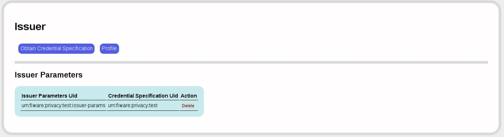

Privacy GEri Users and Programmer's Guide
===============================

# User Guide

We start with the issuer. A freshly installed issuer will look like this:


The first order of the day is to obtain a credential specification. We are here using the ```FAKE``` provider, which is useful for demo purposes, but which MUST NOT BE USED IN PRODUCTION. Note the informative message, which we can ignore in the ```FAKE``` provider.


The code will then look into the respective object (SQL table or LDAP schema) and extract the available attributes. You can then decide which of those attributes you want in your credential. All attributes that you later want to verify or that you want to compute predicates on must be present.


Now we have tied issuer parameters to credential specifications in the issuer parameters.



Now we need to specify a rule that tells us how to extract the attribute from the LDAP schema or SQL table. Since we're using the ```FAKE``` provider, we can put anything in that form field; in production, you may need to put other values here.


Now let's switch to the verifier. The first thing to do is load the system parameters from the issuer.


 

Now let's look at the credential specification:


Back to the user. It's time to get a credential. First, we load the issuer settings and look at the available credential specification.


Now, to obtain a credential for that credential specification, we need to authenticate:


Back to the verifier. We now want to accept a credential for a resource only if the ```someAttribute``` value is less than 123.  For this, we first define a resource, which is simply a name associated with a redirection URL.


Now we define the presentation policy for this resource.


Now finally back to the user. We want to access the resource ```resource```, which we know is protected by the verifier at a specific URL. (This step is made explicit here, but could just as well be automated by giving a specific link.)


The verifier asks us to prove that we possess a credential from our issuer in which ```someAttribute``` is less than 123. The user service goes through our credentials ans shows us all the credentials that match. If there were several, we could choose the one that we like best. (This step is automatable as well so that no actual user interaction is required.)


The verifier tells us that our presentation token has been verified and sends us a redirection URL. We cklick on that URL...


...and see the previously protected reesource. (This step too is automatable so that no actual user interaction is required.)


# Programmer's Guide

For the purposes of this guide, we will assume that the services are deployed under these URLs:

* Issuer: ```http://localhost:8888/zhaw-p2abc-webservices/issuance```
* User: ```http://localhost:8888/zhaw-p2abc-webservices/user```
* Verifier: ```http://localhost:8888/zhaw-p2abc-webservices/verifier```

*NOTE*: You will see that the interaction through the APIs is vastly more complicated than the interaction through the GUIs. This is due to the library-like generic nature of the p2abcengine. The GIUs simplify this interaction by narrowing down choices.

## Overview of Interactions

1. Create system parameters and distribute them to user and verifier. The system parameters contain various things such as the issuer's public key and other cryptographic parameters. They must be the same for issuer, user, and verifier. Or rather, user and verifier must know about the system parameters used by the issuer.
  
2. Set up a credential specification. This entails obtaining the column names and types from the attribute provider and creating a credential specification from the available attributes.

3. Create a query rule. This entails installing a SQL query that selects an integer attribute from the attribute provider. In this case, we will select an "income" attribute.
  
4. Create issuer parameters and an issuance policy. This is a file that says what kinds of credentials will be issued. Issuer, user, and verifier will need the same issuance policy.

5. Create a credential. This is a multi-step process in which the user and issuer exchange a variety of messages. The user authenticates to the issuer using the authentication provider and the issuer then accumulates enough information through a multi-round protocol to issue the credential. The credential is stored in the user service.

6. Create a presentation policy. The verifier wants to grant access to a resource only for people whose incomes are less than 125. (The value of that attribute in the database is 100, so this should verify later.)

7. Create a presentation token. This is a complicated process involving several user interactions (all pre-empted in the GUI version of the service) where the user is shown the credentials that satisfy the presentation policy and is asked to select one.

8. The verifier finally verifies the presentation token sent to it by the user service.

## Set Up System Parameters

First, create system parameters at the issuer.

        curl --user both:tomcat \
             -X POST \
             --header 'Content-Type: text/xml' \
             'http://localhost:8888/zhaw-p2abc-webservices/issuance/protected/setupSystemParameters/\
               ?securityLevel=80\
               &cryptoMechanism=urn:abc4trust:1.0:algorithm:idemix' \
             > ./out/systemparameters.xml

This sets up a new issuer with new system parameters. Every issuer has system parameters; they consist of private key material. The ```securityLevel``` parameter gives the equivalent of bit length in a secret-key encryption scheme. Here we are going for 80 bit security, which is enough for this demonstration. In production, you may want to go for a higher level such as 128.
  
The ```cryptoMechanism``` parameter should be set to Idemix. 

The next step is to install these system parameters at the user and verifier.

        curl -X PUT \
             --header 'Content-Type: text/xml' \
             -d @./out/systemparameters.xml
             'http://localhost:8888/zhaw-p2abc-webservices/user/storeSystemParameters/'

After this step, the file ```systemparameters.xml``` should look something like this:

        <?xml version="1.0" encoding="UTF-8" standalone="yes"?>
          <SystemParameters xmlns="http://abc4trust.eu/wp2/abcschemav1.0"
              Version="1.0">
            <SystemParameters:SystemParameters
                 xmlns:SystemParameters="http://www.zurich.ibm.com/security/idemix" 
                 xmlns="http://www.zurich.ibm.com/security/idemix" 
                 xmlns:xs="http://www.w3.org/2001/XMLSchema" 
                 xmlns:xsi="http://www.w3.org/2001/XMLSchema-instance" 
                 xsi:schemaLocation="http://www.zurich.ibm.com/security/idemix ../xsd/SystemParameters.xsd">
               <Elements>
                 <l_e>597</l_e>
                 <l_ePrime>257</l_ePrime>
                 <l_Gamma>1024</l_Gamma>
                 <l_H>256</l_H>
                 <l_k>144</l_k>
                 <l_m>256</l_m>
                 <l_n>1024</l_n>
                 <l_Phi>80</l_Phi>
                 <l_pt>72</l_pt>
                 <l_r>72</l_r>
                 <l_res>1</l_res>
                 <l_rho>256</l_rho>
                 <l_v>1443</l_v>
                 <l_enc>256</l_enc>
               </Elements>
             </SystemParameters:SystemParameters>
             <GroupParameters:GroupParameters
                 xmlns:GroupParameters="http://www.zurich.ibm.com/security/idemix"
                 xmlns="http://www.zurich.ibm.com/security/idemix"
                 xmlns:xs="http://www.w3.org/2001/XMLSchema" xmlns:xsi="http://www.w3.org/2001/XMLSchema-instance"
                 xsi:schemaLocation="http://www.zurich.ibm.com/security/idemix ../xsd/GroupParameters.xsd">
               <References>
                 <SystemParameters>
                   http://www.zurich.ibm.com/security/idmx/v2/sp.xml
                 </SystemParameters>
               </References>
             <Elements>
               <Gamma>301756703774...</Gamma>
               <g>914837025769...</g>
               <h>238129834933...</h>
               <rho>9089953707...</rho>
             </Elements>
           </GroupParameters:GroupParameters>
           <uprove:KeyLength 
               xmlns:uprove="urn:eu:abc4trust:systemparameters:uprove:1.0">
             2048
           </uprove:KeyLength>
           <uprove:GroupOID 
               xmlns:uprove="urn:eu:abc4trust:systemparameters:uprove:1.0">
             1.3.6.1.4.1.311.75.1.1.1
           </uprove:GroupOID>
           <uprove:NumberOfTokens 
               xmlns:uprove="urn:eu:abc4trust:systemparameters:uprove:1.0">
             50
           </uprove:NumberOfTokens>
         </SystemParameters>

Now we install the system parameters in the user service:

        curl -X PUT \
             --header 'Content-Type: text/xml' \
             -d @./out/systemparameters.xml \
             'http://localhost:8888/zhaw-p2abc-webservices/user/storeSystemParameters/' \
             > ./out/storeSystemParametersResponceAtUser.xml

The response will look like this:

        <?xml version="1.0" encoding="UTF-8" standalone="yes"?>
        <ABCEBoolean
            xmlns="http://abc4trust.eu/wp2/abcschemav1.0"
            value="true"/>

Finaly we install the system parameters in the verifier service:

        curl --user both:tomcat \
             -X PUT \
             --header 'Content-Type: text/xml' \
             -d @./out/systemparameters.xml \
             'http://localhost:8888/zhaw-p2abc-webservices/verification/protected/storeSystemParameters/' \
             > ./out/storeSystemParametersResponceAtVerifier.xml


The response will look like this:

        OK
        
## Set Up Credential Specification

The next step is to set up a credential specification. This is a specification that tells the involved parties what attributes they can expect in a credential.  First, prepare an attribute collection:

        curl --user both:tomcat \
             -X GET 'http://localhost:8888/zhaw-p2abc-webservices/issuance/protected/attributeInfoCollection/userdata' \
             > ./gen/attrInfoCol.xml

The file ```attrInfoCol.xml``` should look something like this:

        <?xml version="1.0" encoding="UTF-8" standalone="yes"?>
        <abc:attribute-info-collection
            xmlns:abc="http://abc4trust.eu/wp2/abcschemav1.0">
          <abc:name>userdata</abc:name>
          <abc:attributes>
            <abc:attribute>
              <abc:name>someAttribute</abc:name>
              <abc:mapping>xs:integer</abc:mapping>
              <abc:encoding>
                urn:abc4trust:1.0:encoding:integer:signed
              </abc:encoding>
              <abc:friendly-descriptions>
                <abc:friendly-description>
                  <abc:language>en</abc:language>
                  <abc:value>someAttribute attribute</abc:value>
                </abc:friendly-description>
              </abc:friendly-descriptions>
            </abc:attribute>
          </abc:attributes>
        </abc:attribute-info-collection>

Now create a credential specification using the attributes:

        curl --user both:tomcat \
             -X POST \
             --header 'Content-Type: application/xml' \
             -d @./gen/attrInfoCol.xml \
             'http://localhost:8888/zhaw-p2abc-webservices/issuance/protected/generateCredentialSpecification/' \
             > ./gen/credSpec.xml

The credential specification will look something like this:

        <?xml version="1.0" encoding="UTF-8" standalone="yes"?>
        <CredentialSpecification
            xmlns="http://abc4trust.eu/wp2/abcschemav1.0"
            Version="1.0"
            KeyBinding="true"
            Revocable="false">
          <SpecificationUID>urn:fiware:privacy:userdata</SpecificationUID>
          <FriendlyCredentialName lang="en">
            userdata credential specification
          </FriendlyCredentialName>
          <AttributeDescriptions MaxLength="256">
            <AttributeDescription
                Type="someAttribute"
                DataType="xs:integer"
                Encoding="urn:abc4trust:1.0:encoding:integer:signed">
              <FriendlyAttributeName lang="en">
                someAttribute attribute
              </FriendlyAttributeName>
            </AttributeDescription>
          </AttributeDescriptions>
        </CredentialSpecification>

We install this credential specification at the user services:

        curl -X PUT \
             --header 'Content-Type: text/xml' \
             -d @./gen/credSpec.xml \
             'http://localhost:8888/zhaw-p2abc-webservices/user/storeCredentialSpecification/urn%3Afiware%3Aprivacy%3Acredspec%3Auserdata' \
             > ./out/storeCredentialSpecificationAtUserResponce.xml

The response will look something like this:

       <?xml version="1.0" encoding="UTF-8" standalone="yes"?>
       <ABCEBoolean
           xmlns="http://abc4trust.eu/wp2/abcschemav1.0"
           value="true"/>

We install this credential specification at the verifier service:

        curl --user both:tomcat \
             -X PUT \
             --header 'Content-Type: text/xml' \
             -d @./gen/credSpec.xml 'http://localhost:8888/zhaw-p2abc-webservices/verification/storeCredentialSpecification/*magic*/urn%3Afiware%3Aprivacy%3Acredspec%3Auserdata' \
             > ./out/storeCredentialSpecificationAtVerifierResponce.xml

The response will look something like this:

        OK
        
## Set Up Query Rule

Now, install a query rule that will look for an integer attribute. Here, we take a column named "income":

        <?xml version="1.0" encoding="UTF-8" standalone="yes"?>
        <abc:query-rule xmlns:abc="http://abc4trust.eu/wp2/abcschemav1.0">
          <abc:query-string>
            SELECT nickname, income FROM userdata WHERE nickname = '_UID_'
          </abc:query-string>
        </abc:query-rule>

If this file is ```queryRule.xml```, we now install this rule at the issuer:

        curl --user both:tomcat \
             -X PUT \
             --header 'Content-Type: application/xml' \
             -d @queryRule.xml \
             'http://localhost:8888/zhaw-p2abc-webservices/issuance/protected/queryRule/store/urn%3Afiware%3Aprivacy%3Auserdata'

## Set Up Issuance Policy

Now the final step to set up the issuer is to install an issuance policy. This is what one may look like:

        <?xml version="1.0" encoding="UTF-8" standalone="yes"?>
        <IssuancePolicy
            xmlns="http://abc4trust.eu/wp2/abcschemav1.0"
            Version="1.0">
          <PresentationPolicy
              PolicyUID="http://thebestbank.com/creditcards/issuance/policy">
            <Message>
              <Nonce>KNsRu9cGzkaeabogeRVV</Nonce>
              <ApplicationData>
                <TestApplicationData>
                  <Data
                      xmlns:xsi="http://www.w3.org/2001/XMLSchema-instance" 
                      xmlns:xs="http://www.w3.org/2001/XMLSchema"
                      xsi:type="xs:string">
                    Generic
                  </Data>
                </TestApplicationData>
              </ApplicationData>
            </Message>
          </PresentationPolicy>
          <CredentialTemplate>
            <CredentialSpecUID>urn:fiware:privacy:userdata</CredentialSpecUID>
            <IssuerParametersUID>urn:fiware:privacy:userdata:issuer-params</IssuerParametersUID>
            <UnknownAttributes/>
          </CredentialTemplate>
        </IssuancePolicy>

We put this in a file called ```issuancePolicy.xml ``` and install it at the issuer:

        curl --user both:tomcat \
             -X PUT \
             --header 'Content-Type: application/xml' \
             -d @issuancePolicy.xml \
             'http://localhost:8888/zhaw-p2abc-webservices/issuance/protected/issuancePolicy/store/urn%3Afiware%3Aprivacy%3Auserdata'

## Set Up Issuer Parameters

The next step is to set up issuer parameters. Issuer parameters could look like this:

        <?xml version="1.0" encoding="UTF-8" standalone="yes"?>
        <abc:IssuerParametersInput 
           xmlns:abc="http://abc4trust.eu/wp2/abcschemav1.0"
           xmlns:xsi="http://www.w3.org/2001/XMLSchema-instance" 
           xsi:schemaLocation="http://abc4trust.eu/wp2/abcschemav1.0 ../../../../../../../../abc4trust-xml/src/main/resources/xsd/schema.xsd"
           Version="1.0">
          <abc:ParametersUID>
            http://mroman.ch/generic/issuance:idemix
          </abc:ParametersUID>
          <abc:FriendlyIssuerDescription lang="en">
            Issuer parameters for generic
          </abc:FriendlyIssuerDescription>
          <abc:AlgorithmID>
            urn:abc4trust:1.0:algorithm:idemix
          </abc:AlgorithmID>
          <abc:CredentialSpecUID>
            urn:fiware:privacy:credspec:userdata
          </abc:CredentialSpecUID>
          <abc:HashAlgorithm>
            urn:abc4trust:1.0:hashalgorithm:sha-256
          </abc:HashAlgorithm>
          <abc:RevocationParametersUID>
            http://mroman.ch/RoomReservation/revocation
          </abc:RevocationParametersUID>
        </abc:IssuerParametersInput>

We install these parameters at the issuer:

        curl --user both:tomcat \
             -X POST \
             --header 'Content-Type: text/xml' \
             -d @./issuerParametersInput.xml \
             'http://localhost:8888/zhaw-p2abc-webservices/issuance/protected/setupIssuerParameters/' \
             > ./out/issuerParameters.xml

The result is a file that looks much like this:

        <?xml version="1.0" encoding="UTF-8" standalone="yes"?>
        <IssuerParameters
            xmlns="http://abc4trust.eu/wp2/abcschemav1.0"
            Version="IDEMIX:2015-09-04T14:08:35">
          <ParametersUID>urn:fiware:privacy:userdata:issuer-params</ParametersUID>
          <FriendlyIssuerDescription lang="en">Issuer parameters for generic</FriendlyIssuerDescription>
          <AlgorithmID>urn:abc4trust:1.0:algorithm:idemix</AlgorithmID>
          <SystemParameters Version="1.0">
            <SystemParameters:SystemParameters
                xmlns:SystemParameters="http://www.zurich.ibm.com/security/idemix"
                xmlns="http://www.zurich.ibm.com/security/idemix"
                xmlns:xs="http://www.w3.org/2001/XMLSchema"
                xmlns:xsi="http://www.w3.org/2001/XMLSchema-instance"
                xsi:schemaLocation="http://www.zurich.ibm.com/security/idemix ../xsd/SystemParameters.xsd">
              <Elements> ... </Elements>
            </SystemParameters:SystemParameters>
            <GroupParameters:GroupParameters
                xmlns:GroupParameters="http://www.zurich.ibm.com/security/idemix" 
                xmlns="http://www.zurich.ibm.com/security/idemix" 
                xmlns:xs="http://www.w3.org/2001/XMLSchema"
                xmlns:xsi="http://www.w3.org/2001/XMLSchema-instance"
                xsi:schemaLocation="http://www.zurich.ibm.com/security/idemix ../xsd/GroupParameters.xsd">
              <References>
                <SystemParameters>http://www.zurich.ibm.com/security/idmx/v2/sp.xml</SystemParameters>
              </References>
              <Elements> ... </Elements>
            </GroupParameters:GroupParameters>
            <uprove:KeyLength
                xmlns:uprove="urn:eu:abc4trust:systemparameters:uprove:1.0">
              2048
            </uprove:KeyLength>
            <uprove:GroupOID
                xmlns:uprove="urn:eu:abc4trust:systemparameters:uprove:1.0">
              1.3.6.1.4.1.311.75.1.1.1
            </uprove:GroupOID>
            <uprove:NumberOfTokens
                xmlns:uprove="urn:eu:abc4trust:systemparameters:uprove:1.0">
              50
            </uprove:NumberOfTokens>
          </SystemParameters>
          <CredentialSpecUID>urn:fiware:privacy:userdata</CredentialSpecUID>
          <HashAlgorithm>urn:abc4trust:1.0:hashalgorithm:sha-256</HashAlgorithm>
          <CryptoParams>
            <IssuerPublicKey:IssuerPublicKey
                xmlns:IssuerPublicKey="http://www.zurich.ibm.com/security/idemix"
                xmlns="http://www.zurich.ibm.com/security/idemix"
                xmlns:xs="http://www.w3.org/2001/XMLSchema"
                xmlns:xsi="http://www.w3.org/2001/XMLSchema-instance"
                xsi:schemaLocation="http://www.zurich.ibm.com/security/idemix ../xsd/IssuerPublicKey.xsd">
              <References>
                <GroupParameters>http://www.zurich.ibm.com/security/idmx/v2/gp.xml</GroupParameters>
                </References>
                <Elements>
                  <S>317390391983683...</S>
                  <Z>860906949944685...</Z>
                  <n>118611787025242...</n>
                  <Bases num="2">
                  <Base>730669267630...</Base>
                  <Base>539643129622...</Base>
                </Bases>
              </Elements>
              <Features>
                <Epoch length="432000"/>
              </Features>
            </IssuerPublicKey:IssuerPublicKey>
          </CryptoParams>
          <RevocationParametersUID>
            http://mroman.ch/RoomReservation/revocation
          </RevocationParametersUID>
        </IssuerParameters>

These issuer parameters must now be stored at the user and the verifier

        curl -X PUT \
             --header 'Content-Type: text/xml' \
             -d @./out/issuerParameters.xml \
             'http://localhost:8888/zhaw-p2abc-webservices/user/storeIssuerParameters/http%3A%2F%2Fmroman.ch%2Fgeneric%2Fissuance%3Aidemix' \
             > ./out/storeIssuerParametersAtUser.xml

        curl --user both:tomcat \
             -X PUT \
             --header 'Content-Type: text/xml' \
             -d @./out/issuerParameters.xml \
             'http://localhost:8888/zhaw-p2abc-webservices/verification/protected/storeIssuerParameters/http%3A%2F%2Fmroman.ch%2Fgeneric%2Fissuance%3Aidemix' \
             > ./out/storeIssuerParametersAtVerifier.xml

The results are, respectively:

        <?xml version="1.0" encoding="UTF-8" standalone="yes"?>
        <ABCEBoolean
            xmlns="http://abc4trust.eu/wp2/abcschemav1.0"
            value="true"/>

and

        OK
       
At this point, issuer, user, and verifier are fully set up.
 
## Issue a Credential

This is a multi-round protocol between user and issuer.  The suer service creates a first issuacne message:

        <?xml version="1.0" encoding="UTF-8" standalone="yes"?>
        <IssuanceMessage
            xmlns="http://abc4trust.eu/wp2/abcschemav1.0"
            Context="abc4trust.eu/issuance-protocol/3a41civjf7dufazx">
          <IssuancePolicy
              Version="1.0">
            <PresentationPolicy
                PolicyUID="http://thebestbank.com/creditcards/issuance/policy">
                <Message>
                  <Nonce>AP7rRHT6Hbst5+w=</Nonce>
                  <ApplicationData>
                    <TestApplicationData>
                      <Data
                          xmlns:xsi="http://www.w3.org/2001/XMLSchema-instance"
                          xmlns:xs="http://www.w3.org/2001/XMLSchema"
                          xsi:type="xs:string">
                        Generic
                      </Data>
                    </TestApplicationData>
                  </ApplicationData>
                </Message>
              </PresentationPolicy>
              <CredentialTemplate>
                <CredentialSpecUID>
                  urn:fiware:privacy:userdata
                </CredentialSpecUID>
                <IssuerParametersUID>
                  urn:fiware:privacy:userdata:issuer-params
                </IssuerParametersUID>
                <UnknownAttributes/>
              </CredentialTemplate>
            </IssuancePolicy>
          </IssuanceMessage>

This message is posted to the issuer:

        curl -X POST \
             --header 'Content-Type: text/xml'
             -d @./out/firstIssuanceMessage.xml \
             'http://localhost:8888/zhaw-p2abc-webservices/user/issuanceProtocolStep/' \
             > ./out/issuanceReturn.xml

The return will look something like this:

        <?xml version="1.0" encoding="UTF-8" standalone="yes"?>
        <ns2:IssuanceReturn
            xmlns:ns2="http://abc4trust.eu/wp2/abcschemav1.0">
          <uia>
            <uiContext>ui-context-i//jpzi121ilfi5qep</uiContext>
            <data>
              <credentialSpecifications>
                <credentialSpecification 
                    uri="urn:fiware:privacy:userdata">
                  <spec
                      Version="1.0"
                      KeyBinding="true"
                      Revocable="false">
                    <ns2:SpecificationUID>
                      urn:fiware:privacy:userdata
                    </ns2:SpecificationUID>
                    <ns2:FriendlyCredentialName lang="en">
                      userdata credential specification
                    </ns2:FriendlyCredentialName>
                    <ns2:AttributeDescriptions MaxLength="256">
                      <ns2:AttributeDescription
                          Type="someAttribute"
                          DataType="xs:integer"
                          Encoding="urn:abc4trust:1.0:encoding:integer:signed">
                        <ns2:FriendlyAttributeName lang="en">
                          someAttribute attribute
                        </ns2:FriendlyAttributeName>
                      </ns2:AttributeDescription>
                    </ns2:AttributeDescriptions>
                  </spec>
                </credentialSpecification>
              </credentialSpecifications>
              <issuers>
                <issuer uri="urn:fiware:privacy:userdata:issuer-params">
                  <revocationAuthorityUri>
                    http://mroman.ch/RoomReservation/revocation
                  </revocationAuthorityUri>
                  <description>
                    <description lang="en">
                      Issuer parameters for generic
                    </description>
                  </description>
                  <spec ref="urn:fiware:privacy:userdata"/>
                </issuer>
              </issuers>
              <revocationAuthorities/>
              <credentials/>
              <pseudonyms/>
              <inspectors/>
              </data>
                <tokenCandidates>
                  <tokenCandidate candidateId="0">
                    <tokenDescription
                        PolicyUID="http://thebestbank.com/creditcards/issuance/policy"
                        TokenUID="abc4t://token/4x79ri6453dutl0m">
                      <ns2:Message>
                        <ns2:Nonce>AP7rRHT6Hbst5+w=</ns2:Nonce>
                        <ns2:ApplicationData>
                          <ns2:TestApplicationData>
                            <ns2:Data
                                xmlns:xsi="http://www.w3.org/2001/XMLSchema-instance"
                                xmlns:xs="http://www.w3.org/2001/XMLSchema"
                                xsi:type="xs:string">
                              Generic
                            </ns2:Data>
                          </ns2:TestApplicationData>
                        </ns2:ApplicationData>
                      </ns2:Message>
                    </tokenDescription>
                    <credentials/>
                    <pseudonymCandidates>
                      <pseudonymCandidate candidateId="0">
                        <pseudonyms/>
                      </pseudonymCandidate>
                    </pseudonymCandidates>
                    <revealedFacts/>
                    <revealedAttributeValues/>
                    <inspectableAttributes/>
                  </tokenCandidate>
                </tokenCandidates>
                <policy Version="1.0">
                  <ns2:PresentationPolicy
                      PolicyUID="http://thebestbank.com/creditcards/issuance/policy">
                    <ns2:Message>
                      <ns2:Nonce>AP7rRHT6Hbst5+w=</ns2:Nonce>
                      <ns2:ApplicationData>
                        <ns2:TestApplicationData>
                          <ns2:Data
                              xmlns:xsi="http://www.w3.org/2001/XMLSchema-instance"
                              xmlns:xs="http://www.w3.org/2001/XMLSchema"
                              xsi:type="xs:string">
                            Generic
                          </ns2:Data>
                        </ns2:TestApplicationData>
                      </ns2:ApplicationData>
                    </ns2:Message>
                  </ns2:PresentationPolicy>
                  <ns2:CredentialTemplate>
                    <ns2:CredentialSpecUID>
                      urn:fiware:privacy:userdata
                    </ns2:CredentialSpecUID>
                    <ns2:IssuerParametersUID>
                      urn:fiware:privacy:userdata:issuer-params
                    </ns2:IssuerParametersUID>
                    <ns2:UnknownAttributes/>
                    </ns2:CredentialTemplate>
                  </policy>
                </uia>
              </ns2:IssuanceReturn>

At this point in the interaction, the user would normaly be asked to choose from various identities. We do that for him or her.

        UiContext=`cat ./out/issuanceReturn.xml \
          | sed 's/^.*<uiContext>//' \
          | sed 's/<\/uiContext>.*//'`
        cat ./uiIssuanceReturn.xml \
          | sed "s#REPLACE-THIS-CONTEXT#${UiContext}#" \
          > ./out/uiIssuanceReturn.xml
        curl -X POST \
             --header 'Content-Type: text/xml' \
             -d @./out/uiIssuanceReturn.xml \
             'http://localhost:8888/zhaw-p2abc-webservices/user/issuanceProtocolStepUi/' \
             > ./out/secondIssuanceMessage.xml
        curl -X POST \
             --header 'Content-Type: text/xml' \
             -d @./out/secondIssuanceMessage.xml \
             'http://localhost:8888/zhaw-p2abc-webservices/issuance/issuanceProtocolStep/' \
             > ./out/thirdIssuanceMessageAndBoolean.xml
        curl -X POST \
             --header 'Content-Type: text/xml' \
             -d @./out/thirdIssuanceMessageAndBoolean.xml \
             'http://localhost:8888/zhaw-p2abc-webservices/user/extractIssuanceMessage/' \
             > ./out/thirdIssuanceMessage.xml
        curl -X POST \
             --header 'Content-Type: text/xml' \
             -d @./out/thirdIssuanceMessage.xml \
             'http://localhost:8888/zhaw-p2abc-webservices/user/issuanceProtocolStep/' \
             > ./out/fourthIssuanceMessageAndBoolean.xml


At this point, the user service has a credential.

We want to access a protected resource at the verifier, so the next step is to create a presentation token:

        curl -X POST \
             --header 'Content-Type: text/xml'
             -d @./presentationPolicyAlternatives.xml \
             'http://localhost:12001/zhaw-p2abc-webservices/verification/createPresentationPolicy/' \
             > ./out/presentationPolicyAlternatives.xml

        curl -X POST \
             --header 'Content-Type: text/xml' \
             -d @./out/presentationPolicyAlternatives.xml \
             'http://localhost:12001/zhaw-p2abc-webservices/user/createPresentationToken/' \
             > ./out/presentationReturn.xml

        UiContext=`cat ./out/presentationReturn.xml \
          | sed 's/^.*<uiContext>//' \
          | sed 's/<\/uiContext>.*//'`
        cat ./uiPresentationReturn.xml \
          | sed "s#REPLACE-THIS-CONTEXT#${UiContext}#" \
          > ./out/uiPresentationReturn.xml
  
        curl -X POST \
             --header 'Content-Type: text/xml' \
             -d @./out/uiPresentationReturn.xml \
             'http://localhost:12001/zhaw-p2abc-webservices/user/createPresentationTokenUi/' \
             > ./out/presentationToken.xml

        presentationPolicy=`cat ./out/presentationPolicyAlternatives.xml \
          | sed 's/^.*<PresentationPolicyAlternatives xmlns="http:\/\/abc4trust.eu\/wp2\/abcschemav1.0" Version="1.0">//' \
          | sed 's/<\/PresentationPolicyAlternatives>.*//'`
        presentationToken=`cat ./out/presentationToken.xml \
          | sed 's/^.*<PresentationToken xmlns="http:\/\/abc4trust.eu\/wp2\/abcschemav1.0" Version="1.0">//' \
          | sed 's/<\/PresentationToken>.*//'`
        echo '<?xml version="1.0" encoding="UTF-8" standalone="yes"?>' \
          > ./out/presentationPolicyAlternativesAndPresentationToken.xml
        echo '<PresentationPolicyAlternativesAndPresentationToken xmlns="http://abc4trust.eu/wp2/abcschemav1.0" Version="1.0"> <PresentationPolicyAlternatives>' \
          >> ./out/presentationPolicyAlternativesAndPresentationToken.xml
        echo "${presentationPolicy}" \
          >> ./out/presentationPolicyAlternativesAndPresentationToken.xml
        echo '</PresentationPolicyAlternatives>' \
          >> ./out/presentationPolicyAlternativesAndPresentationToken.xml
        echo '<PresentationToken>' \
          >> ./out/presentationPolicyAlternativesAndPresentationToken.xml
        echo "${presentationToken}" \
          >> ./out/presentationPolicyAlternativesAndPresentationToken.xml
        echo '</PresentationToken>' \
          >> ./out/presentationPolicyAlternativesAndPresentationToken.xml
        echo '</PresentationPolicyAlternativesAndPresentationToken>' \
          >> ./out/presentationPolicyAlternativesAndPresentationToken.xml

Finally, we can send that to the verifier and have it verified:

        curl -X POST \
             --header 'Content-Type: text/xml' \
             -d @./out/presentationPolicyAlternativesAndPresentationToken.xml \
             'http://localhost:12001/zhaw-p2abc-webservices/verification/verifyTokenAgainstPolicy/' \
             > ./out/presentationTokenDescription.xml

The reuslt is this:

        <?xml version="1.0" encoding="UTF-8" standalone="yes"?>
        <PresentationTokenDescription
            xmlns="http://abc4trust.eu/wp2/abcschemav1.0"
            PolicyUID="urn:fiware:privacy:policy:userdata"
            TokenUID="abc4t://token/3vvitxmqokul35e2">
          <Message>
            <Nonce>XM1Z/VuKlgid3g==</Nonce>
            <ApplicationData>Generic</ApplicationData>
          </Message>
          <Credential Alias="#ticket">
            <CredentialSpecUID>urn:fiware:privacy:userdata</CredentialSpecUID>
            <IssuerParametersUID>
              urn:fiware:privacy:userdata:issuer-params
            </IssuerParametersUID>
          </Credential>
          <AttributePredicate
              Function="urn:oasis:names:tc:xacml:1.0:function:integer-less-than">
            <Attribute
                CredentialAlias="#ticket"
                AttributeType="someAttribute"/>
            <ConstantValue
                xmlns:abc="http://abc4trust.eu/wp2/abcschemav1.0"
                xmlns:xsi="http://www.w3.org/2001/XMLSchema-instance">
              125
            </ConstantValue>
          </AttributePredicate>
        </PresentationTokenDescription>
